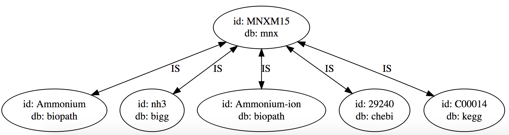

[]()
[](https://codecov.io/gh/DD-DeCaF/id-mapper)

# ID Mapper

Powered by [Venom](https://github.com/biosustain/venom)

Based on [MetaNetX](http://www.metanetx.org/). Information about metabolites and reactions is provided by [MNXref namespace](http://www.metanetx.org/mnxdoc/mnxref.html)

Example on how to find a match for the chemical with [BIGG](https://github.com/biosustain/venom) id `nh3` in [BioPath](https://webapps.molecular-networks.com/biopath3/biopath3) database:

```
GET /idmapping/query?id=nh3&db_from=bigg&db_to=biopath HTTP/1.1
Accept: */*
Accept-Encoding: gzip, deflate
Connection: keep-alive


HTTP/1.1 200 OK
Connection: keep-alive
Content-Length: 36
Content-Type: application/json

{
    "ids": [
        "Ammonia",
        "Ammonium-ion"
    ]
}
```

The graph consists of large amount of connected components. A connected component is considered being one object: a metabolite or a reaction. Search is returning all the elements in the component with `db_to` database name.

